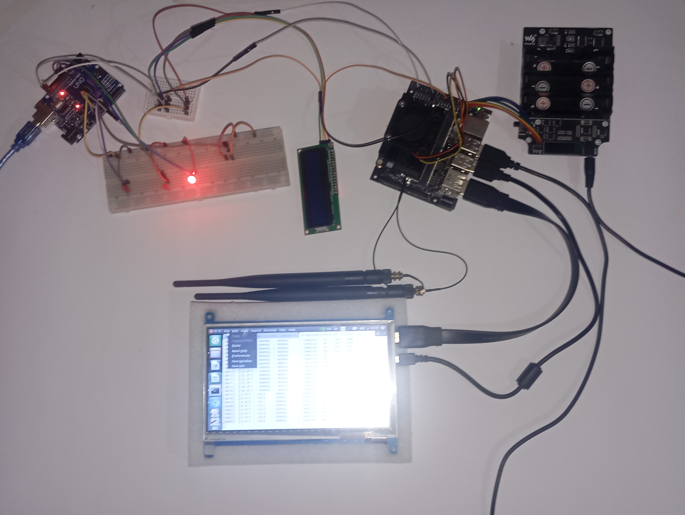
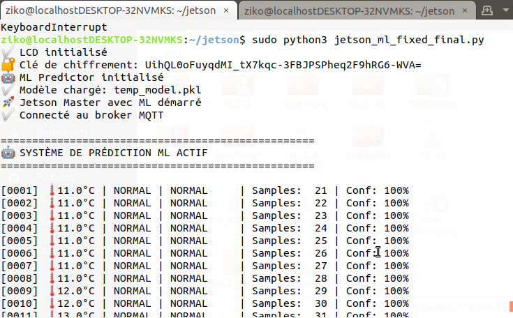
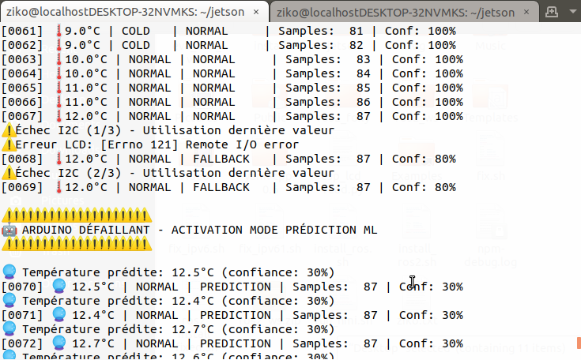
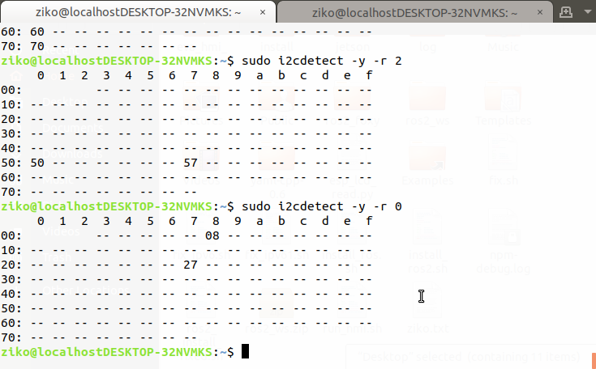
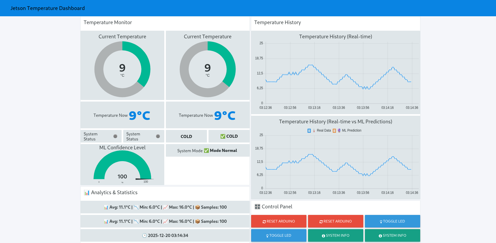

# 🌡️ IoT Temperature Monitoring with ML Fault Tolerance

[](https://www.python.org/downloads/)
[](https://www.arduino.cc/)
[](https://opensource.org/licenses/MIT)

An IoT temperature monitoring system with **automatic ML-based fault tolerance**. When the Arduino sensor fails, the system seamlessly switches to machine learning predictions to maintain 100% service continuity.

<div align="center">
  
  <p><i>Three-layer architecture: Edge (Arduino) → Gateway (Jetson Nano) → Cloud (Node-RED)</i></p>
</div>

<div align="center">
  
  <p><i>Prototype</i></p>
</div
---

## ⚡ Key Features

- **🤖 ML Fault Tolerance**: Automatic failover to linear regression predictions during sensor failures
- **📊 Real-time Dashboard**: Node-RED interface with dual-trace visualization (real vs predicted data)
- **⚡ Edge Computing**: Local ML inference on Jetson Nano (<1ms latency)
- **🎯 High Accuracy**: ±0.35°C during normal operation, ±0.5°C during failures
- **🔌 Robust I2C**: Automatic error detection and recovery

---

## 🛠️ Hardware Components

| Component | Model | Function |
|-----------|-------|----------|
| **SBC** | NVIDIA Jetson Nano 4GB | Master controller, ML inference |
| **MCU** | Arduino Uno | Temperature sensor, I2C slave |
| **Display** | LCD 16x2 I2C | Local temperature display |
| **LEDs** | RGB 5mm | Visual status indicators |

---

## 🚀 Quick Start

### 1. Clone Repository
```bash
git clone https://github.com/yourusername/iot-temp-monitor-ml.git
cd iot-temp-monitor-ml
```

### 2. Upload Arduino Code
```bash
# Open arduino/arduino_temp_sensor.ino in Arduino IDE
# Select Board: Arduino Uno
# Upload (Ctrl+U)
```

### 3. Run Jetson System
```bash
cd jetson
pip install -r requirements.txt
python3 jetson_ml_fixed_final.py
```

### 4. Launch Node-RED Dashboard
```bash
node-red
# Import flows.json from node-red folder
# Access: http://localhost:1880/ui
```

---

## 📡 System Communication

**I2C Protocol** (Arduino ↔ Jetson)
- Frequency: 400 kHz
- Arduino Address: 0x08
- LCD Address: 0x27

**MQTT Protocol** (Jetson ↔ Node-RED)
- Broker: broker.hivemq.com:1883
- Topic: `jetson/temperature`
- Format: JSON

---

## 🧠 ML Model

**Algorithm**: Multivariate Linear Regression
- **Features**: Last 5 temperature readings
- **Training**: Incremental (every 50 samples)
- **Inference**: <1ms on Jetson Nano

```
T̂(n+1) = Σ(wi × T(n-i)) + b
```

---

## 🔄 Operating Modes

| Mode | Trigger | Data Source | Accuracy |
|------|---------|-------------|----------|
| **NORMAL** ✅ | I2C success | Arduino sensor | ±0.35°C |
| **FALLBACK** ⚠️ | 1-2 I2C failures | Last valid value | ±0.35°C |
| **PREDICTION** 🔮 | 3+ I2C failures | ML model | ±0.5°C |

---

## 📊 System in Action

### Normal Operation - I2C Communication
<div align="center">
  
  <p><i>Console showing successful I2C communication with Arduino</i></p>
</div>

### Fault Detection - ML Prediction Mode
<div align="center">
  
  <p><i>System automatically switches to ML predictions when Arduino fails</i></p>
</div>

### I2C Device Detection
<div align="center">
  
  <p><i>Arduino (0x08) and LCD (0x27) detected on I2C bus</i></p>
</div>

### Live Dashboard
<div align="center">
  
  <p><i>Node-RED dashboard showing real-time data and ML predictions</i></p>
</div>

---

## 📈 Performance Results

- **Service Continuity**: 100%
- **ML Prediction Accuracy**: ±0.35°C MAE
- **Recovery Time**: <1 second
- **ML Confidence**: 30% → 90% (adaptive)

---

## 📁 Repository Structure

```
iot-temp-monitor-ml/
├── arduino/
│   └── arduino_temp_sensor.ino
├── jetson/
│   ├── jetson_ml_fixed_final.py
│   ├── jetson_lcd.py
│   └── requirements.txt
├── node-red/
│   └── flows.json
├── Media/
│   ├── fig2.png
│   ├── terminal_normal.png
│   ├── terminal_prediction.png
│   ├── i2c_detection.png
│   └── dashboard_nodered_detail.png
├── rapport.pdf
├── LICENSE
└── README.md
```

---

## 🐛 Troubleshooting

**Arduino not detected?**
```bash
sudo i2cdetect -y 1  # Should show 0x08
```

**LCD not working?**
```bash
sudo i2cdetect -y 1  # Should show 0x27
```

**MQTT connection failed?**
```bash
ping broker.hivemq.com
```

---


